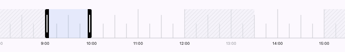

## Horizontal timeline widget.

[](https://pub.dev/packages/horizontal_timeline)


Draws a 24-hour scrollable time scale with 15-minute increments, allowing you to select a time range.



## Features

* Limiting the available time range.
* Full customization.
* Animated
* Interactive

## Getting started

### 1. Add the Timeline widget at a dependency.

To add a package compatible with the Flutter SDK to your project, use dart pub add.

For example:

`dart pub add timeline_widget`

### 2. Usage

> 🚧 **For correct operation, a parent Scrollable widget is required!**

> 🚧 **Be sure to limit the height, the widget has no minimum height!**

> 🚧 **The scrollable parent element must have `hitTestBehavior` set to `HitTestBehavior.deferToChild`. Otherwise, events will not reach the selector.**

```dart
import 'package:flutter/material.dart';
import 'package:horizontal_timeline/horizontal_timeline.dart';

void main() {
  runApp(const MainApp());
}

class MainApp extends StatelessWidget {
  const MainApp({super.key});

  @override
  Widget build(BuildContext context) {
    return MaterialApp(
      home: ConstrainedBox(
              constraints: BoxConstraints.loose(Size.fromHeight(75)),
              child: SingleChildScrollView(
                scrollDirection: Axis.horizontal,
                hitTestBehavior: HitTestBehavior.deferToChild,
                child: Timeline(
                  initialSelectorRange: TimeRange(begin: TimeOfDay(hour: 9, minute: 0), end: TimeOfDay(hour: 10, minute: 0)),
                  availableRanges: {TimeRange(begin: TimeOfDay(hour: 9, minute: 0), end: TimeOfDay(hour: 18, minute: 0))},
                ),
            ),
        ),
    );
  }
}
```